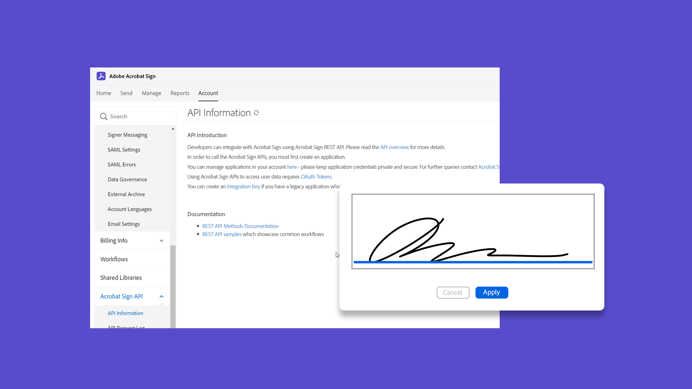

# Acrobat Signチュートリアル

Adobe Document CloudソリューションであるAcrobat Signは、統合、API、高度な認証、追加の管理機能などを使用して、組織のニーズに合わせて拡張できます。 ここでは、Acrobat Signを使って初心者と管理者の両方に学習のスピードを速めるために設計された、幅広い学習体験を見つけることができます。

## 学習パス

<table style="table-layout:fixed">
<tr>
  <td>
    
    

    <a href="sign-beginner-tutorials/beginner-users-overview.md"><strong>はじめに</strong></a>
    

    文書の送信、署名、トラックの方法を把握する
     
  </td>
  <td>
    
    

    <a href="sign-advanced-users/advanced-users-overview.md"><strong>高度なタスク</strong></a>
    

    特定のタスクと自動化で基本を超える
     
  </td>
   <td>
    
    

    <a href="admin/intro-admin-overview.md"><strong>管理者</strong></a>
    

    組織での基本的な設定から高度な設定のヒント
     
  </td>
   <td>
    
    

    <a href="digitalid/digitalid-overview.md"><strong>デジタルID</strong></a>
    

    Acrobat Signで世界中のデジタルIDを使用する方法を学ぶ
     
  </td>
</tr>
<tr>
    <td>
    
    

    <a href="integrations/integrations-overview.md"><strong>統合</strong></a>
    

    別のアプリケーション内に直接Acrobat Signを追加
     
    </td>
  <td>
    
    

    <a href="sign-usecase/expand-inspire-overview.md"><strong>業界と部門</strong></a>
    

    実際の業界および部門のユースケースを探る
     
  </td>
  <td>
    
    

    <a href="develop/develop-overview.md"><strong>開発</strong></a>
    

    Acrobat Sign I/Oの開発資料を入手する
     
  </td>
  <td>
    
    

    <a href="deploy-overview.md"><strong>デプロイ</strong></a>
    

    組織内にAcrobat Signをデプロイするための洞察とベストプラクティス
     
  </td>
</tr>
<tr>
  <td>
    
    

    <a href="mobile/mobile-overview.md"><strong>モバイル</strong></a>
    

    モバイルデバイスでリアルタイムの送信、署名、更新を行う
     
  </td>
</tr>
</table>