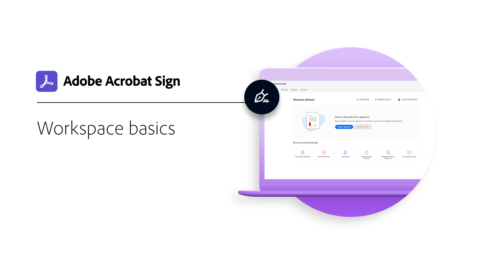
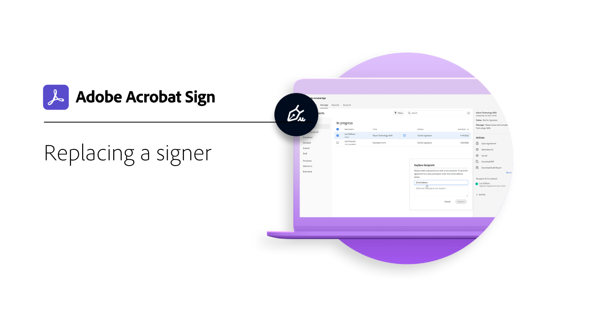
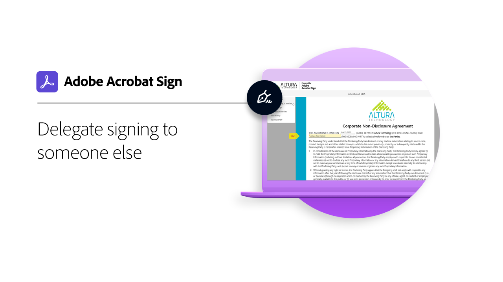

# はじめに/概要

手順を追った簡単なチュートリアルで、文書の送信、署名、追跡の方法を確認してください。 Acrobat Signのクイックツアーを視聴した後、他のユーザーに文書を送信します。 このコンテンツは、電子サインワークフローを容易にするように設計されています。

## 新機能

* [Acrobat Signの概要](new-sender.md)
Acrobat Signを使うのは初めてですか？ このチュートリアルは、チュートリアルを開始するのに最適な場所です。
* [期限とリマインダーの設定](set-deadlines-reminders.md)
定期的に電子メールのリマインダーを送信して、文書にすばやく署名してもらう方法について説明します

## Send

<table style="table-layout:fixed">
<tr>
 <td>
    
    

    <a href="quick-tour.md"><strong>ワークスペースの基本</strong></a>
    

    <em>Acrobat Signワークスペースのクイックツアーを開始して、使い方を学習しましょう</em>
     
  </td>
  <td>
    
    

    <a href="new-sender.md"><strong>Acrobat Signの概要</strong></a>
    

    <em>この包括的なチュートリアルは、Acrobat Signの新しい送信者を開始するのに最適な場所です</em>
     
  </td>
  <td>
    
    

    <a href="send-to-single-recipient.md"><strong>1人の受信者に送信しています</strong></a>
    

    <em>署名用に文書を送信する簡単さを学ぶ</em>
     
  </td>
  <td>
    
    

    <a href="send-to-multiple-recipients.md"><strong>複数の受信者への送信</strong></a>
    

    <em>電子サイン用の文書を複数の人に正確に希望する順序で送信します</em>
     
  </td>
</tr>
<tr>
  <td>
    
    

    <a href="sending-options.md"><strong>送信オプションの構成</strong></a>
    

    <em>署名用に文書を送信する際のさまざまなオプションを設定する方法を説明します</em>
     
  </td>
  <td>
    
    

    <a href="adding-fields.md"><strong>文書にフィールドを追加しています</strong></a>
    

    <em>文書に各種フィールドを追加する方法を説明します</em>
     
  </td>
  <td>
    
    

    <a href="modify-in-flight.md"><strong>送信後の文書の変更</strong></a>
    

    <em>既に進行中のドキュメントを変更する</em>
     
  </td>
  <td>
    
    

    <a href="replace-signer.md"><strong>署名者を置き換えています</strong></a>
    

    <em>既に処理中の文書の署名者を変更する方法を説明します</em>
      
  </td>
</tr>
<tr>
  <td>
      
      

      <a href="set-deadlines-reminders.md"><strong>期限とリマインダーの設定</strong></a>
      

      <em>定期的に電子メールのリマインダーや期限を送信して、文書にすばやく署名する方法について説明します</em>
       
    </td> 
  <td>
      
      

       
    </td>
    <td>
      
      

       
    </td>
    <td>
      
      

       
    </td>
</tr>
</table>

## 署名

<table style="table-layout:fixed">
<tr>
  <td>
    
    

    <a href="electronically-sign-a-document.md"><strong>文書に電子サインを行っています</strong></a>
    

    <em>Acrobat Signで送信された文書に簡単に署名する方法を説明します</em>
     
  </td>
  <td>
    
    

    <a href="fill-and-sign.md"><strong>文書への入力と署名</strong></a>
    

    <em>フォームに入力して文書に電子サインを追加</em>
     
  </td>
  <td>
    
    

    <a href="sign-in-person.md"><strong>署名者を取得しています</strong></a>
    

    <em>Acrobat Signモバイルアプリを使用して、他のユーザーの署名を直接取得する</em>
     
  </td>
  <td>
    
    

    <a href="delegate-signing.md"><strong>他のユーザーに署名を委任する</strong></a>
    

    <em>文書の署名を他のユーザーに委任する方法を学ぶ</em>
     
  </td>
</tr>
<tr>
  <td>
    
    

    <a href="sign-with-a-digital-signature.md"><strong>デジタル署名とは</strong></a>
    

    <em>証明書ベースのデジタル署名の詳細</em>
     
  </td>
  <td>
    
    

    <a href="sign-with-a-stamp.md"><strong>スタンプを使用して署名</strong></a>
    

    <em>スタンプを使用して、ドキュメントを承認または完了にマークする</em>
      
  </td> 
 <td>
    
    

     
  </td>
  <td>
    
    

     
  </td>
</tr>  
</table>

## 管理

<table style="table-layout:fixed">
<tr>
  <td>
    
    

    <a href="manage-and-track.md"><strong>契約書を管理およびトラック</strong></a>
    

    <em>署名用に送信された契約書を管理およびトラックする方法について説明します</em>
     
  </td>
  <td>
    
    

    <a href="../sign-advanced-users/create-a-template.md"><strong>ドキュメントテンプレートを作成しています</strong></a>
    

    <em>再利用可能な文書テンプレートを作成して、組織のスピードと一貫性を確保します</em>
     
  </td>
  <td>
    
    

     
  </td>
  <td>
    
    

     
  </td>
</tr>
</table>
