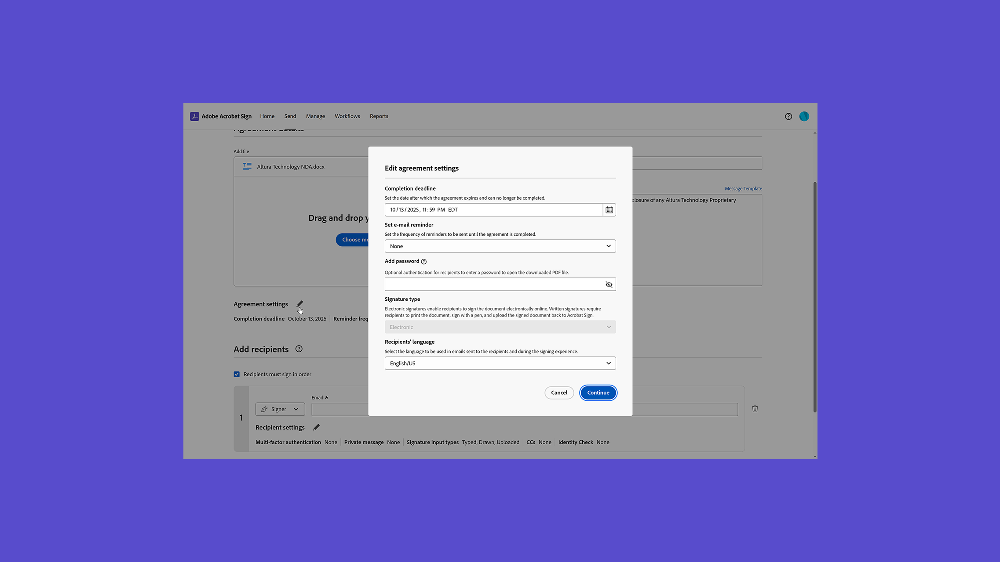
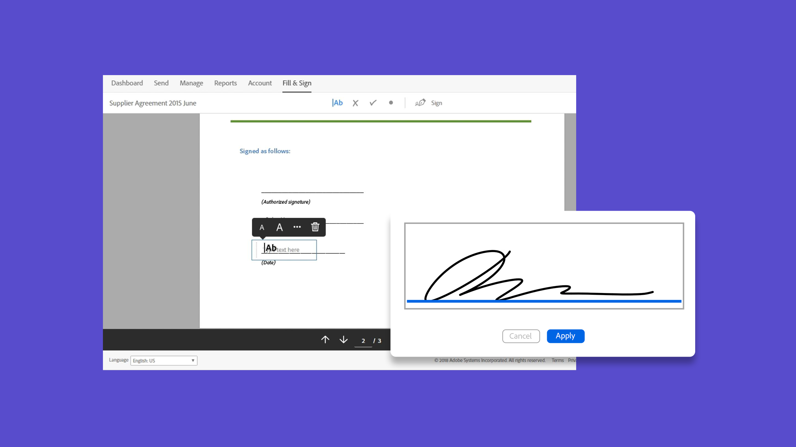

# はじめに/概要

手順を追った簡単なチュートリアルで、文書の送信、署名、追跡の方法を確認してください。 Acrobat Signのクイックツアーを視聴した後、他のユーザーに文書を送信します。 このコンテンツは、電子サインワークフローを容易にするように設計されています。

## 新機能

>[!BEGINTABS]

>[!TAB Acrobat Signの概要]

Acrobat Signを使うのは初めてですか？ この[チュートリアル](new-sender.md)は、始めるのに最適な場所です。

>[!TAB 期限とリマインダーの設定]

定期的に[リマインダーと期限](set-deadlines-reminders.md)の電子メールを送信して、文書にすばやく署名してもらう方法について説明します。

>[!ENDTABS]

## Send

<table style="table-layout:fixed">
<tr>
 <td>
    
    

    <a href="quick-tour.md"><strong>ワークスペースの基本</strong></a>
    

    Acrobat Signワークスペースのクイックツアーで基本を学習しましょう
     
  </td>
  <td>
    
    

    <a href="new-sender.md"><strong>Acrobat Signの概要</strong></a>
    

    このチュートリアルは、Acrobat Signの新規ユーザーのために作業を開始するのに最適です
     
  </td>
  <td>
    
    

    <a href="send-to-single-recipient.md"><strong>1人の受信者に送信しています</strong></a>
    

    署名用に文書を送信する簡単な方法を学びましょう
     
  </td>
  <td>
    
    

    <a href="send-to-multiple-recipients.md"><strong>複数の受信者への送信</strong></a>
    

    電子サイン用の文書を複数の宛先に正確に希望の順序で送信します
     
  </td>
</tr>
<tr>
  <td>
    
    

    <a href="sending-options.md"><strong>送信オプションの構成</strong></a>
    

    署名用に文書を送信する際の各種オプションの設定方法について説明します
     
  </td>
  <td>
    
    

    <a href="adding-fields.md"><strong>文書にフィールドを追加しています</strong></a>
    

    文書に各種フィールドを追加する方法について説明します
     
  </td>
  <td>
    
    

    <a href="modify-in-flight.md"><strong>送信後の文書の変更</strong></a>
    

    既に処理中の文書を変更する
     
  </td>
  <td>
    
    

    <a href="replace-signer.md"><strong>署名者を置き換えています</strong></a>
    

    既に処理中の文書の署名者を変更する方法について説明します
      
  </td>
</tr>
<tr>
  <td>
      
      

      <a href="set-deadlines-reminders.md"><strong>期限とリマインダーの設定</strong></a>
      

      定期的に電子メールのリマインダーを送信して、文書にすばやく署名してもらう方法について説明します
       
    </td> 
  <td>
      
      

       
    </td>
    <td>
      
      

       
    </td>
    <td>
      
      

       
    </td>
</tr>
</table>

## 署名

<table style="table-layout:fixed">
<tr>
  <td>
    
    

    <a href="electronically-sign-a-document.md"><strong>文書に電子サインを行っています</strong></a>
    

    Acrobat Signで送信された文書に簡単に署名する方法を説明します。
     
  </td>
  <td>
    
    

    <a href="fill-and-sign.md"><strong>文書への入力と署名</strong></a>
    

    フォームに入力し、文書に電子サインを追加
     
  </td>
  <td>
    
    

    <a href="sign-in-person.md"><strong>署名者を取得しています</strong></a>
    

    Acrobat Signモバイルアプリを使用して他のユーザーの署名を対面で取得
     
  </td>
  <td>
    
    

    <a href="delegate-signing.md"><strong>他のユーザーに署名を委任する</strong></a>
    

    文書の署名を他のユーザーに委任する方法を学ぶ
     
  </td>
</tr>
<tr>
  <td>
    
    

    <a href="sign-with-a-digital-signature.md"><strong>デジタル署名とは</strong></a>
    

    証明書ベースの電子署名の詳細
     
  </td>
  <td>
    
    

    <a href="sign-with-a-stamp.md"><strong>スタンプを使用して署名</strong></a>
    

    スタンプを使用して、文書を承認または完了としてマーク
      
  </td> 
 <td>
    
    

     
  </td>
  <td>
    
    

     
  </td>
</tr>  
</table>

## 管理

<table style="table-layout:fixed">
<tr>
  <td>
    
    

    <a href="manage-and-track.md"><strong>契約書を管理およびトラック</strong></a>
    

    署名用に送信された契約書を管理およびトラックする方法について説明します
     
  </td>
  <td>
    
    

    <a href="../sign-advanced-users/create-a-template.md"><strong>ドキュメントテンプレートを作成しています</strong></a>
    

    再利用可能な文書テンプレートを作成して、組織の速度と一貫性を確保できます
     
  </td>
  <td>
    
    

     
  </td>
  <td>
    
    

     
  </td>
</tr>
</table>
