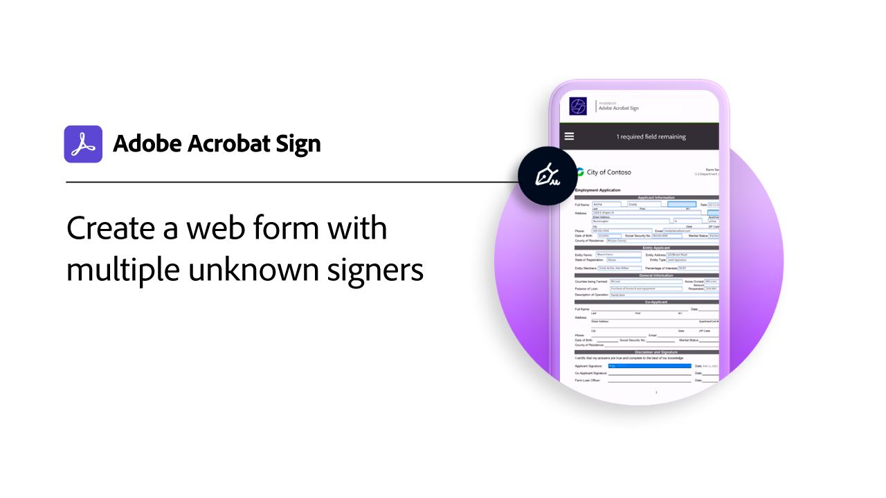

# 使用事例

様々な組織がAcrobat Signを使用して、これらの実際のユースケースで組織のデジタルワークフローを変革する方法について説明します。

## 新機能

>[!BEGINTABS]

>[!TAB 教育機関向けIEPプロセスのカスタムワークフロー]

[カスタムワークフローDesigner](usecase-edu-iep.md)を使用して、個人教育プログラム(IEP)プロセスをデジタル化する方法について説明します。

>[!TAB 教育機関向けWebフォームのインターンシップ申請]

[webフォーム](usecase-edu-intern.md)を使用して、学生が必要なフォームにアクセスしやすくする方法について説明します。

>[!TAB 教育用Webフォームインターンシップアプリケーションを作成する]

インターンシップ[Webフォーム](usecase-edu-intern-create.md)の作成方法について説明します。

>[!TAB 複数の不明な署名者を伴う政府の融資申請]

[Webフォーム](webform-multiple-signers.md)を、複数の不明な参加者を含む複雑な政府融資申し込みワークフローで使用する方法について説明します。

>[!ENDTABS]

## 官公庁のユースケース

<table style="table-layout:fixed">
<tr>
  <td>
    
    

    <a href="webform-multiple-signers.md"><strong>複数の不明な署名者を伴う政府の融資申請</strong></a>
    

    <em>複数の不明な参加者を含む複雑な政府融資申し込みワークフローでWebフォームがどのように使用されるかを説明します</em>
     
  </td> 
  <td>
    
    

    <a href="usecasegovgrants.md"><strong>事業上の助成金およびローン</strong></a>
    

    <em>助成金、ローン、および税金の繰延要求フォームへのセルフサービスアクセスを提供して、企業を迅速に支援します</em>
     
  </td> 
  <td>
    
    

    <a href="usecasegovtelework.md"><strong>テレワーク契約書</strong></a>
    

    <em>テレワーク契約、ポリシーの更新などですべての従業員から署名を効率的に収集します</em>
     
  </td>
  <td>
    
    

    <a href="usecasegovcontracts.md"><strong>契約と要求フォーム</strong></a>
    

    <em>監査レポートを備えた、コンプライアンスに準拠したデジタルワークフローによる紙媒体の処理をすばやく置き換える</em>
     
  </td>
</tr>
<tr>
 <td>
    
    

    <a href="usecasegovreemployment.md"><strong>再就職のサポート</strong></a>
    

    <em>数日で使用可能なオールデジタルの申請用紙に沿って市民が必要なサポートを受けられるように支援する</em>
     
  </td>
  <td>
    
    

    <a href="usecasegovpaycheck.md"><strong>給与チェックの保護</strong></a>
    

    <em>Acrobat Signを使用して、Payment Protection Programフォームをオンラインインタラクティブフォームに変換する方法をご覧ください</em>
     
  </td>
  <td>
    
    

    <a href="usecasegovremote.md"><strong>リモート許可要求</strong></a>
    

    <em>電子サインとWeb会議を一緒に使用して、審査員からの令状の要求とセキュリティ保護にかかる時間を短縮します</em>
     
  </td>
  <td>
    
    

     
  </td>
</tr>
</table>

## 商用ユースケース

<table style="table-layout:fixed">
<tr>
  <td>
    
    

    <a href="usecasecomcontracts.md"><strong>契約と要求フォーム</strong></a>
    

    <em>監査レポートを備えた、コンプライアンスに準拠したデジタルワークフローによる紙媒体の処理をすばやく置き換える</em>
     
  </td> 
  <td>
    
    

    <a href="usecasecompolicy.md"><strong>ポリシーの契約書</strong></a>
    

    <em>ポリシーの契約と更新に関して、すべての従業員から署名を効率的に収集する</em>
     
  </td>
  <td>
    
    

    <a href="usecasecomtelework.md"><strong>テレワーク契約書</strong></a>
    

    <em>テレワーク契約書ですべての従業員から署名を効率的に収集する</em>
     
  </td>
  <td>
    
    

     
  </td>
</tr>
</table>

## 教育機関向けユースケース

<table style="table-layout:fixed">
<tr>
  <td>
    
    

    <a href="usecase-edu-intern.md"><strong>教育機関向けWebフォームのインターンシップ申請</strong></a>
    

    <em>Webフォームを使用して、学生の必須フォームへのアクセスを改善する方法を説明します</em>
     
  </td> 
  <td>
    
    

    <a href="usecase-edu-intern-create.md"><strong>教育用Webフォームインターンシップアプリケーションを作成する</strong></a>
    

    <em>インターン用Webフォームの作成方法</em>
     
  </td> 
  <td>
    
    

    <a href="usecase-edu-iep.md"><strong>教育機関向けIEPプロセスのカスタムワークフロー</strong></a>
    

    <em>カスタムワークフローDesignerを使用して、個人化教育プログラム(IEP)プロセスをデジタル化する方法を説明します</em>
     
  </td>
  <td>
    
    

     
  </td>
</tr>
</table>

