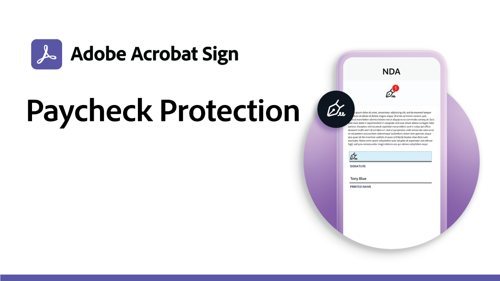

# ユースケースのレシピ

これらの官公庁および民間の電子サインの例を使用して、組織のデジタルワークフローをスピードアップできます。 クリックすると、これらの電子サインのユースケースを設定する方法に関するリソースや詳細を含むPDFが表示されます。

## 新機能

* [教育機関向けIEPプロセスのカスタムワークフロー](usecase-edu-iep.md)
カスタムワークフローデザイナーを使用して、個人化教育プログラム(IEP)プロセスをデジタル化する方法について説明します
* [教育機関webフォームインターンシップ申請](usecase-edu-intern.md)
Webフォームを使用して、学生が必要なフォームに簡単にアクセスできるようにする方法を説明します
* [教育用Webフォームインターンシップ申請の作成](usecase-edu-intern-create.md)
インターンwebフォームの作成方法を学ぶ
* [複数の不明な署名者を含む政府からの融資申請](webform-multiple-signers.md)
複数の不明な参加者を含む複雑な政府ローン申請ワークフローでWebフォームを使用する方法について説明します

## 官公庁のユースケース

<table style="table-layout:fixed">
<tr>
  <td>
    
    

    <a href="webform-multiple-signers.md"><strong>複数の不明な署名者を含む政府からの融資申請</strong></a>
    

    <em>複数の不明な参加者を含む複雑な政府ローン申請ワークフローでWebフォームを使用する方法について説明します</em>
     
  </td> 
  <td>
    
    

    <a href="usecasegovgrants.md"><strong>事業助成金及び貸付金</strong></a>
    

    <em>助成金、ローン、および税金の繰延要求フォームへのセルフサービスアクセスを提供することで、企業を迅速に支援する</em>
     
  </td> 
  <td>
    
    

    <a href="usecasegovtelework.md"><strong>テレワーク契約書</strong></a>
    

    <em>テレワーク契約書やポリシーの更新などに関して、すべての従業員から署名を効率的に収集</em>
     
  </td>
  <td>
    
    

    <a href="usecasegovcontracts.md"><strong>契約および請求フォーム</strong></a>
    

    <em>監査レポートを備えた、コンプライアンスに準拠したデジタル・ワークフローにより、紙の処理を迅速に置き換え</em>
     
  </td>
</tr>
<tr>
 <td>
    
    

    <a href="usecasegovreemployment.md"><strong>再就職援助</strong></a>
    

    <em>市民が数日で使用可能なオールデジタルの申請用紙に従わなくても、必要な支援を受けられるように支援します。</em>
     
  </td>
  <td>
    
    

    <a href="usecasegovpaycheck.md"><strong>支払いチェックの保護</strong></a>
    

    <em>Acrobat Signを使用して、Payment Protection Programフォームをオンラインインタラクティブフォームに変換する方法について説明します。</em>
     
  </td>
  <td>
    
    

    <a href="usecasegovremote.md"><strong>リモートの令状要求</strong></a>
    

    <em>電子サインとWeb会議を一緒に使用して、審査員からの令状の要求と保護にかかる時間を短縮</em>
     
  </td>
  <td>
    
    

     
  </td>
</tr>
</table>

## 商用ユースケース

<table style="table-layout:fixed">
<tr>
  <td>
    
    

    <a href="usecasecomcontracts.md"><strong>契約および請求フォーム</strong></a>
    

    <em>監査レポートを備えた、コンプライアンスに準拠したデジタル・ワークフローにより、紙の処理を迅速に置き換え</em>
     
  </td> 
  <td>
    
    

    <a href="usecasecompolicy.md"><strong>ポリシーの契約書</strong></a>
    

    <em>ポリシーの契約書や更新に関して、すべての従業員から署名を効率的に収集</em>
     
  </td>
  <td>
    
    

    <a href="usecasecomtelework.md"><strong>テレワーク契約書</strong></a>
    

    <em>テレワーク契約書ですべての従業員から署名を効率的に収集</em>
     
  </td>
  <td>
    
    

     
  </td>
</tr>
</table>

## 教育機関向けユースケース

<table style="table-layout:fixed">
<tr>
  <td>
    
    

    <a href="usecase-edu-intern.md"><strong>教育機関webフォームインターンシップ申請</strong></a>
    

    <em>Webフォームを使用して、学生が必要なフォームに簡単にアクセスできるようにする方法を説明します</em>
     
  </td> 
  <td>
    
    

    <a href="usecase-edu-intern-create.md"><strong>教育用Webフォームインターンシップ申請の作成</strong></a>
    

    <em>インターンwebフォームの作成方法を学ぶ</em>
     
  </td> 
  <td>
    
    

    <a href="usecase-edu-iep.md"><strong>教育機関向けIEPプロセスのカスタムワークフロー</strong></a>
    

    <em>カスタムワークフローデザイナーを使用して、個人化教育プログラム(IEP)プロセスをデジタル化する方法について説明します</em>
     
  </td>
  <td>
    
    

     
  </td>
</tr>
</table>

